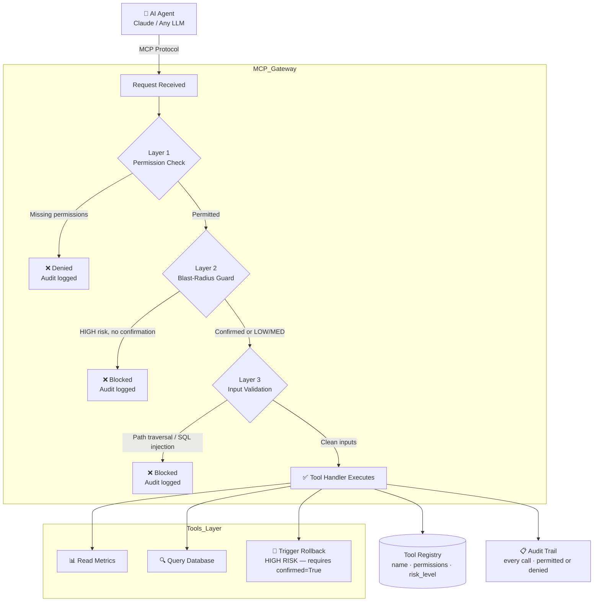

# production-mcp-server


A production-grade MCP (Model Context Protocol) server demonstrating how to safely expose tools to AI agents in enterprise environments.

Built for AI agents operating on infrastructure serving **500,000+ end customers** and processing millions of assets in a large-scale migration. At this scale, an ungoverned agent making a wrong tool call isn't a dev environment incident — it's a customer-facing outage.

Most MCP examples show how to *connect* tools to agents. This repo shows how to do it *safely at scale* — with permission enforcement, behavioral guardrails, blast-radius controls, and structured audit trails on every invocation.

---

## The Problem → Solution → Impact

| | |
|---|---|
| **Problem** | AI agents need tool access to be useful — but unconstrained tool access causes production incidents. Teams either lock agents down (useless) or give full access (dangerous). |
| **Solution** | A governed MCP gateway layer that sits between every agent and every tool: permission-checked, blast-radius controlled, and fully audited on every call. |
| **Impact** | Agents operate safely in production with enterprise-grade authorization. Security teams can audit every action. Developers ship agent features without fear of side effects. |

---

## System Design



---

## Layer Breakdown

| Layer | What It Does | Why It Matters |
|-------|-------------|----------------|
| **Tool Registry** | Stores name, description, required permissions, and risk level for every tool | Single source of truth — no tool runs without being registered |
| **Permission Enforcement** | Checks caller permissions against tool requirements before execution | Agents can only call tools they are explicitly authorized for |
| **Blast-Radius Guard** | Requires `confirmed=True` for HIGH risk operations | Agents cannot accidentally trigger destructive operations |
| **Input Validation** | Blocks path traversal, destructive SQL, and other attack patterns | Defense-in-depth — validates before any handler runs |
| **Audit Trail** | Immutable append-only log of every invocation | Complete auditability for compliance and debugging |

## The Problem

When AI agents gain tool access, three failure modes emerge immediately:

1. **Unconstrained access** — agents call tools they shouldn't, causing unintended side effects
2. **No audit trail** — when something goes wrong, you can't reconstruct what the agent did
3. **Silent failures** — permission errors are swallowed, making debugging impossible

This server addresses all three.

## Architecture

```
Agent (Claude / any LLM)
        │
        ▼ MCP Protocol
┌─────────────────────────────┐
│        MCP Server           │
│  ┌──────────────────────┐   │
│  │    Guardrail Layer   │   │  ← permission check → blast-radius guard → arg validation
│  └──────────┬───────────┘   │
│             │               │
│  ┌──────────▼───────────┐   │
│  │    Tool Registry     │   │  ← name, description, required_permissions, risk_level
│  └──────────┬───────────┘   │
│             │               │
│  ┌──────────▼───────────┐   │
│  │    Tool Handlers     │   │  ← plain Python functions, no security logic here
│  └──────────────────────┘   │
│             │               │
│  ┌──────────▼───────────┐   │
│  │     Audit Trail      │   │  ← every invocation logged, permitted or denied
│  └──────────────────────┘   │
└─────────────────────────────┘
```

## Key Patterns

### 1. Governed Tool Access

Every tool is registered with explicit permission requirements:

```python
registry.register(ToolDefinition(
    name="trigger_rollback",
    description="Initiate a deployment rollback.",
    handler=trigger_rollback,
    required_permissions={"deployments:write", "deployments:rollback"},
    risk_level=RiskLevel.HIGH,
    requires_confirmation=True,  # blast-radius guard
))
```

### 2. Permission Enforcement

The guardrail layer checks permissions before any handler runs:

```python
# Agent tries to trigger rollback but lacks deployments:write
guardrails.invoke(
    tool_name="trigger_rollback",
    arguments={"deployment_id": "d-123", "reason": "high error rate"},
    caller_id="monitoring-agent",
    caller_permissions={"deployments:read"},  # missing write permission
)
# → PermissionDeniedError: Caller 'monitoring-agent' lacks permissions
#   {'deployments:write', 'deployments:rollback'} for tool 'trigger_rollback'
```

### 3. Blast-Radius Controls

HIGH risk tools require an explicit confirmation flag — agents cannot accidentally trigger destructive operations:

```python
# Without confirmation — blocked
guardrails.invoke("trigger_rollback", {...}, confirmed=False)
# → GuardrailViolationError: HIGH risk tool requires confirmed=True

# With confirmation — permitted
guardrails.invoke("trigger_rollback", {...}, confirmed=True)
```

### 4. Input Validation

Argument-level checks run before any tool handler:

```python
# Path traversal — blocked automatically
guardrails.invoke("read_file", {"path": "../../etc/passwd"}, ...)
# → GuardrailViolationError: Path traversal detected

# Destructive SQL — blocked automatically
guardrails.invoke("query", {"query": "DROP TABLE users"}, ...)
# → GuardrailViolationError: Destructive SQL pattern detected
```

### 5. Structured Audit Trail

Every invocation — permitted or denied — is recorded:

```python
# After some invocations
events = audit.get_events()
print(events[0].to_json())
# {
#   "tool_name": "read_deployment_status",
#   "caller_id": "oncall-agent-v1",
#   "arguments": {"deployment_id": "d-abc"},
#   "result": "{'status': 'healthy', ...}",
#   "permitted": true,
#   "timestamp": "2026-08-26T14:30:00+00:00",
#   "duration_ms": 12.4
# }

print(f"Denied requests: {audit.denied_count()}")
```

## Project Structure

```
production-mcp-server/
├── src/
│   ├── server.py          # MCP server entry point — tool registration + FastMCP wiring
│   ├── registry.py        # Tool registry — metadata, permissions, risk classification
│   ├── guardrails.py      # Guardrail layer — 3-layer enforcement on every invocation
│   ├── audit.py           # Structured audit trail — append-only event log
│   └── tools/
│       └── example_tools.py  # Example handlers — swap with your real data sources
├── tests/
│   ├── test_guardrails.py    # Permission enforcement, blast-radius, input validation
│   └── test_registry.py      # Tool registration and lookup
├── examples/
│   └── basic_usage.py        # Standalone usage without the MCP server
└── pyproject.toml
```

## Installation

```bash
pip install -e ".[dev]"
```

## Running the Server

```bash
python -m src.server
```

Connect any MCP-compatible client (Claude Desktop, Claude Code, etc.) to the server.

## Running Tests

```bash
pytest tests/ -v
```

## Extending

### Adding a New Tool

1. Write the handler function in `src/tools/`:
```python
def read_config(config_key: str) -> str:
    return os.environ.get(config_key, "not_found")
```

2. Register it with permissions and risk level:
```python
registry.register(ToolDefinition(
    name="read_config",
    description="Read a configuration value by key.",
    handler=read_config,
    required_permissions={"config:read"},
    risk_level=RiskLevel.LOW,
))
```

3. Expose via FastMCP:
```python
@mcp.tool()
def config(config_key: str) -> str:
    return guardrails.invoke("read_config", {"config_key": config_key}, ...)
```

The guardrail and audit layers apply automatically — no changes needed there.

### Integrating Your Auth Layer

Replace the static `CALLER_ID` / `CALLER_PERMISSIONS` in `server.py` with your real identity provider:

```python
# Example: derive permissions from an OAuth token in the MCP session context
def get_caller_context(session) -> tuple[str, set[str]]:
    token = session.headers.get("Authorization")
    claims = verify_jwt(token)
    return claims["sub"], set(claims["permissions"])
```

## Design Decisions & Trade-offs

### 1. Why 3 layers — and why in this specific order

The guardrail layers run in this exact sequence: **permission check → blast-radius guard → argument validation**. The order is not arbitrary.

**Permission check first:** This is an O(1) set intersection. If the caller doesn't hold the required permission, reject immediately — before processing the arguments at all. Cheap, definitive, no wasted work.

**Blast-radius guard second:** If the operation is HIGH risk and unconfirmed, reject before any argument parsing. The blast-radius check doesn't need to know what the arguments say — it only needs the risk level registered on the tool definition.

**Argument validation last:** Pattern matching and input parsing are the most expensive operations. They only run on requests that have already passed the authorization checks. Running them first would process potentially adversarial input before deciding whether the caller is even permitted.

**Inverting this order** (validate args first, check permissions last) means you're parsing `../../etc/passwd` before you've determined whether the caller can even call the tool. Defense-in-depth requires that the cheapest, most definitive checks run first.

---

### 2. Why `confirmed=False` is the default for HIGH risk tools

The blast-radius guard requires `confirmed=True` to execute HIGH risk operations. The default is `False` — callers must explicitly pass `confirmed=True`.

**Why not the reverse (default=True, override to False)?** Because defaults get inherited. If a caller copies a code pattern and forgets to handle the confirmation, the default should be safe (blocked), not unsafe (executed). Opt-in risk means accidental omissions fail closed.

This mirrors the principle behind IAM deny-by-default: absence of explicit allowance is a denial.

---

### 3. Rate limiting — where it belongs and why

Rate limiting is intentionally not implemented in this layer. The correct placement depends on your deployment pattern:

| Deployment | Rate limit placement |
|-----------|---------------------|
| Single agent, one MCP server | In the LLM gateway (upstream) — limit by model tokens/min |
| Multiple agents, shared MCP server | In the MCP server — limit by caller_id |
| Multi-tenant | At the API gateway (downstream of MCP) — limit by tenant |

For a shared MCP server with multiple agents, the pattern is a token bucket per `caller_id`:

```python
from collections import defaultdict
import time

class RateLimiter:
    def __init__(self, calls_per_minute: int = 60):
        self._buckets: dict[str, list[float]] = defaultdict(list)
        self._limit = calls_per_minute
        self._window = 60.0

    def check(self, caller_id: str) -> bool:
        now = time.monotonic()
        bucket = self._buckets[caller_id]
        # Evict calls outside the window
        self._buckets[caller_id] = [t for t in bucket if now - t < self._window]
        if len(self._buckets[caller_id]) >= self._limit:
            return False  # rate limited
        self._buckets[caller_id].append(now)
        return True
```

**Why token bucket over fixed window:** Fixed windows allow 2× the configured rate at window boundaries (burst at end of one window + burst at start of next). Token bucket smooths this out. For agentic systems where tool calls can cascade, burst control matters more than for human-driven APIs.

---

### 4. Why the audit log is append-only

Every invocation — permitted or denied — is written to an append-only log. There is no `delete_event()` or `clear()` method.

**Why:** Audit trails are for incident post-mortems and compliance reviews. A log that can be modified or cleared is not an audit trail — it's a suggestion. SOC 2 Type II and ISO 27001 both require immutable audit evidence for privileged operations.

In production, back this with an append-only storage target: CloudWatch Logs (no delete API), S3 with Object Lock, or an immutable database table.

---

### 5. Why MCP — not a custom protocol

MCP is an open protocol (published by Anthropic, 2024). Building a custom protocol has two costs:

1. **Client compatibility:** Every LLM client would need a custom integration. MCP-compatible clients (Claude Desktop, Claude Code, any MCP SDK) work out of the box.
2. **Security review surface:** Protocol parsing is an attack surface. Inheriting a reviewed, published protocol is safer than reviewing your own.

The guardrail, audit, and registry layers here are application-level logic on top of MCP — they're independent of the protocol choice and would work equally well over gRPC or REST.

---

### 6. Human-in-the-loop is a design constraint, not a feature flag

The most important principle in this system: **the agent NEVER takes an irreversible action without explicit human confirmation.** This is not implemented as a prompt instruction ("please ask before deleting"). It's enforced at the infrastructure layer — the MCP gateway physically cannot execute a HIGH-risk, irreversible operation without `confirmed=True`.

Why this matters: LLMs can be confidently wrong. A well-designed agentic system doesn't trust the model's judgment on irreversible actions — it routes them through human approval unconditionally. The blast-radius guard is the infrastructure enforcement of this principle.

**What "irreversible" means in practice:**
- Production rollbacks affecting more than N deployments
- Any write to a dataset the agent hasn't operated on before
- Deletions of any kind
- Actions that affect external parties (posting to ticketing systems, sending notifications)

All of these should be HIGH risk, `requires_confirmation=True` in your tool registry. No exceptions.

## Why This Matters

AI agents operating with tool access in production need the same controls as any privileged service: least-privilege authorization, input validation, blast-radius limits, and a complete audit trail. This repo is a reference implementation of those patterns using the MCP protocol.

## License

MIT

---

## Part of the Agentic Infrastructure Stack

This repo is one piece of a production AI agent infrastructure portfolio:

| Repo | What It Is |
|------|-----------|
| **[agentic-ops](https://github.com/TushGoel/agentic-ops)** | Full system design: how these pieces fit together in a production deployment that eliminated 95% of manual oncall triage |
| **[production-mcp-server](https://github.com/TushGoel/production-mcp-server)** | ← You are here: the MCP governance layer |
| **[agent-eval-framework](https://github.com/TushGoel/agent-eval-framework)** | How agent quality is measured and regressions caught before they ship |
